# Vigil — Hands-Free Voice Copilot for EMS

> A medic on a cardiac-arrest or pediatric-anaphylaxis call needs a weight-based dose where a
> decimal-point error is fatal — and they can't look at a screen. **Vigil lets EMS providers ask
> out loud and hear the exact protocol dose spoken back**, with the dangerous part — the number —
> coming straight from the source protocol, never from a language model. Hands and eyes stay on
> the patient.

Vigil is built for the EMS field-provider spectrum — **EMTs, AEMTs, and Paramedics** — and every
dose answer is gated to what the speaking provider's certification level is authorized to
administer (see [Role-based authorization](#role-based-authorization)).

---

## The one claim we defend

> **It is structurally impossible for Vigil to hallucinate a dose, because the LLM is
> architecturally removed from the dose path.**

This isn't a prompt-engineering promise — it's enforced by the code's shape:

- **The dose path is pure.** `agent/vigil/core/` imports nothing external (no `livekit`, no LLM,
  no Moss). An AST scan in [`agent/tests/test_core_purity.py`](agent/tests/test_core_purity.py)
  fails the build if a model call can ever reach the dose logic. *That test is the claim.*
- **Tier-1 doses are spoken verbatim.** The number that reaches text-to-speech is copied
  byte-for-byte from the retrieved protocol chunk's `value_spoken` field — never assembled in
  code, never produced by a model.
- **Tier-2 uses an LLM, but can't invent a number.** Synthesis answers are constrained to
  retrieved chunks, PII-redacted first, and run through a **number-grounding guard** that discards
  any answer introducing a number absent from the source chunks.
- **On any miss, it says so.** Either tier degrades to a fixed safe fallback —
  *"Not in protocol. Contact medical control."* — never a guess, never a crash.

Correctness and safety are the hero here; latency is the supporting act.

---

## What it does (at a glance)

Always-on speech-to-text watches for the wake word **"Vigil"**; everything after it is the query.
The agent routes each query to one of two tiers:

| | **Tier 1 — Dose / contraindication** | **Tier 2 — Soft synthesis** |
|---|---|---|
| For | "What's the dose of X?" | "What should I consider before X?", "Is X contraindicated given Y?" |
| Retrieval | Exact keyword (`alpha=0`) + `$eq` drug & population filter | Hybrid (`alpha≈0.6`, semantic-leaning) |
| LLM | **None, ever** | Minimax, constrained to retrieved chunks |
| Output | Verbatim protocol dose, spoken + glance card | Grounded 1-sentence answer + card |

**Example — Tier 1.** *"Vigil, what's the adult epinephrine dose for anaphylaxis"* →
🔊 *"zero point five milligrams"* and a glance card reading **EPINEPHRINE · 0.5 mg IM · ADULT ·
anaphylaxis · CoSD-EMS-P-115-2025 p.13**.

**Example — Tier 2.** *"Vigil, what should I consider before giving epinephrine?"* → a short,
chunk-grounded spoken answer with citations on the card.

**Example — adversarial.** A drug not in the protocol, or an unanswerable dose → 🔊 *"Not in
protocol. Contact medical control."*

---

## Architecture



*(Source: [`diagrams/vigil_system_architecture.svg`](diagrams/vigil_system_architecture.svg).)*

```
React Native app (Expo dev build)            ← thin client: mic + speaker + glance card
  ── mic audio (always-on) ──▶
LiveKit Cloud  (real-time transport + Inference STT)
  ── transcript ──▶
Python LiveKit agent  (the brain)
   • detect wake word "Vigil", endpoint the turn
   • alias-normalize the drug  (epi → EPINEPHRINE (1:1,000))  ← BEFORE retrieval
   • route: Tier 1 (dose) vs Tier 2 (synthesis)
   • Moss IN-PROCESS retrieval  (0 network, 3–10 ms)
   • Tier 1: verbatim dose, role-gated   |   Tier 2: PII redact → Minimax LLM → grounding guard
   • Minimax TTS → session.say(spoken_form)
  ── answer audio + card JSON (data channel) ──▶
React Native app  (plays audio, flashes the high-contrast glance card)
```

**Calls per query:**

| Stage | Tier 1 | Tier 2 |
|---|---|---|
| LiveKit transport (audio up, audio + card down) | 1 | 1 |
| LiveKit Inference STT (`deepgram/nova-3`) | 1 | 1 |
| Moss retrieval | in-process, **0 network** | in-process, **0 network** |
| Minimax LLM | **0** | 1 |
| Minimax TTS | 1 | 1 |

> **Not offline.** Moss runs **server-side, in-process in the agent** — fast (no per-query
> network), but this is *not* an on-device / airplane-mode product. The win is the deterministic,
> no-hallucination dose path, not edge inference.

---

## Sequence & latency

The full interactive timing comparison is in
[`diagrams/vigil_sequence_timing_diagram.html`](diagrams/vigil_sequence_timing_diagram.html)
(open it in a browser). Static summary:

**Tier 1 — dose lookup (~600 ms end-to-end):**

| Time | From → To | Step |
|---|---|---|
| 0 ms | Device → LiveKit | Audio stream (WebRTC) |
| | LiveKit → Agent | Transcript event (STT) |
| ~300 ms | Agent | Wake-word + alias + route |
| | Agent → Moss | Keyword query (α=0) |
| +<10 ms | Moss → Agent | Verbatim protocol chunk |
| | Agent | Build `spoken_form` + card |
| | Agent → Minimax | TTS request (`spoken_form`) |
| +~200 ms | Minimax → Agent | Audio bytes |
| **~600 ms** | Agent → LiveKit → Device | Plays audio, renders card |

**Tier 2 — soft synthesis (~1400 ms end-to-end):** identical, plus a hybrid query (α≈0.6) →
ranked chunks → **PII redact** → **Minimax LLM call (grounded, +~800 ms)** → grounding guard,
before the TTS step. The in-process Moss query stays 3–10 ms in both tiers; the cost difference is
the one Tier-2 LLM call. Latency is reported as a secondary metric.

---

## Repository layout

```
vigil/
├── agent/              ← the brain: Python LiveKit agent  (start here)
│   ├── vigil/core/         pure logic — wake, aliases, router, pipeline, disambig,
│   │                       roles, redact, prompt, grounding  (NO external imports)
│   ├── vigil/ports/        interfaces — RetrievalIndex, Speaker, CardChannel, Synthesizer
│   ├── vigil/adapters/     FakeIndex, MossIndex, LiveKit speaker/channel, MinimaxSynthesizer
│   ├── agent.py            LiveKit worker entrypoint (the only edge that touches LiveKit)
│   ├── token_server.py     tiny /token endpoint the app calls to join the room
│   ├── data/chunks.json    protocol data (88 chunks, 26 drugs)
│   └── tests/              hermetic E2E + unit gate ; tests/integration/ (opt-in, live)
├── app/                ← the client: React Native / Expo thin client
│   └── src/                GlanceCard (Tier1/Tier2/NotFound), hooks, types, theme
├── data/chunks.json    ← the protocol corpus (mirror of agent/data/chunks.json)
├── diagrams/           ← system architecture (SVG) + sequence timing (HTML)
└── README.md
```

Deeper docs: [`agent/README.md`](agent/README.md) (run/test the agent),
[`agent/INTEGRATION.md`](agent/INTEGRATION.md) (app↔agent contract),
[`app/CLAUDE.md`](app/CLAUDE.md) (client conventions), and the architecture contract in
[`agent/CLAUDE.md`](agent/CLAUDE.md).

**Project lineage.** Vigil grew out of two earlier spikes that still live in the repo:
- **`unsiloed-test/`** — the ingestion pipeline: source protocol PDF → Unsiloed parse → `chunk.py`
  → `chunks.json` (the corpus the agent now consumes).
- **`moss-test/`** — the retrieval prototype + `create_index.py`, which builds the Moss
  `vigil-protocol` index from `chunks.json`, plus CLI references for aliasing and role auth.

These are historical/supporting tooling — the live product is `agent/` + `app/`.

---

## The data & the safety contract

The corpus ([`data/chunks.json`](data/chunks.json)) is **88 chunks across 26 drugs**, derived from
the **CoSD-EMS-P-115-2025** San Diego County EMS protocol: 44 flat doses, 32 weight-based
(pediatric) doses, 12 contraindications. Each chunk is `{ id, text, metadata }`; the metadata
drives everything downstream:

| Field | Meaning |
|---|---|
| `drug` | canonical name the Tier-1 filter matches exactly (e.g. `EPINEPHRINE (1:1,000)`) |
| `patient_type` | `adult` \| `pediatric` \| `all` (contraindications are `all`) |
| `record_type` | `dose` \| `dose_weight_based` \| `contraindication` |
| `value_spoken` | **➜ spoken verbatim by TTS** (e.g. `"zero point five milligrams"`) |
| `value_machine` | dose string for the glance card (e.g. `Epinephrine 1:1,000 (1 mg/mL) 0.5 mg IM, MR x2 q5 min`) |
| `page`, `route`, `source` | citation + administration route for the card |

> 🔒 **Safety contract:** on Tier 1, `value_spoken` is spoken byte-for-byte. `value_machine` and
> `page` are for the visual card only. Pediatric weight-based doses come back as a "see drug chart"
> spoken form rather than a fabricated number.

---

## Two-tier retrieval (the safety core)

**Tier 1 — deterministic, life-critical.**
1. **Alias-normalize before retrieval** — the make-or-break step. Spoken synonyms map to one
   canonical name (`adrenaline`/`epi`/`EpiPen` → `EPINEPHRINE (1:1,000)`) so an exact filter can
   hit. STT word-gluing is repaired too (`"epidose"` → `"epi dose"`).
2. **Exact lookup** — `alpha=0` (pure keyword) + `$eq` on `drug` and `population`. No embedding,
   fully deterministic.
3. **Disambiguation** — when one (drug, population) has multiple doses separated only by indication
   (e.g. **atropine adult: 1 mg for bradycardia vs 2 mg for organophosphate poisoning**), the agent
   resolves by indication or asks **one** clarifying question (named indications, never a number) —
   it never guesses.
4. **Role gating** — the chosen dose is gated by the provider's authorization (below).
5. **Speak the verbatim `value_spoken`.** No LLM touches this path.

**Tier 2 — soft synthesis.** Hybrid retrieval (`alpha≈0.6`) → PII redaction → a constrained
Minimax prompt (cite chunks, never emit an unseen number) → the **number-grounding guard** →
spoken answer + cited card. Any failure → the safe fallback.

### Role-based authorization

Every protocol drug is colored for the three EMS levels by who may administer it, sourced
deterministically from the protocol PDF's header fills:

| | Meaning | Vigil's behavior |
|---|---|---|
| 🟢 **authorized** | permitted for that role | speaks the dose verbatim |
| 🟡 **conditional** | permitted with a limitation (LEMSA-approved) | speaks the dose **+** a non-numeric caveat |
| 🔴 **not authorized** | prohibited for that role | **withholds the number**, redirects ("seek a paramedic") |

The dose number itself is never altered — gating only wraps or withholds it. The provider's role
comes from the auth profile (default `PARAMEDIC` for the demo); a hands-free spoken role
declaration is also recognized.

---

## Run the demo

Prerequisites: Python **3.12** (via pyenv — 3.14 is incompatible with `livekit-agents`), Node for
the app, and credentials in `agent/.env` (copy `agent/.env.example`): LiveKit Cloud keys + a
Minimax API key. See [`agent/README.md`](agent/README.md) for the full credential table.

### Option A — Full phone demo

```bash
cd agent
.venv/bin/python token_server.py     # /token endpoint on :8080 (mints the room JWT)
.venv/bin/python agent.py dev        # agent worker → auto-joins room "vigil-demo" on demand
```

The agent dials **out** (no inbound port); the **token endpoint** is the only thing the app must
reach — give the app `http://<laptop-LAN-IP>:8080/token` on the same Wi-Fi, or an
`ngrok http 8080` URL for cellular. Then build and run the client:

```bash
cd app
# set EXPO_PUBLIC_TOKEN_ENDPOINT_URL in app/.env to the token endpoint
npm install
npm run dev-build                    # Expo prebuild + native iOS build (WebRTC needs native)
```

The app joins via the token, the agent is auto-dispatched into the room, mic is always-on, and the
glance card renders from the data channel (topic `"card"`). Full contract:
[`agent/INTEGRATION.md`](agent/INTEGRATION.md).

### Option B — No phone (local mic ↔ speaker)

```bash
cd agent
.venv/bin/python agent.py console    # interactive voice loop on your laptop
```

### Option C — Hermetic proof (no creds, no network)

```bash
cd agent
.venv/bin/python -m pytest tests -v  # the 100% Tier-1 gate + Tier-2 + grounding + purity test
```

This is the fastest way to *show the claim*: the purity test proves the LLM can't reach the dose
path, and the gold-set gate proves every Tier-1 query returns the exact protocol dose.

### Demo script (say these out loud)

| Say | Expect |
|---|---|
| *"Vigil, what's the adult epinephrine dose for anaphylaxis"* | 🔊 "zero point five milligrams" + Tier-1 card |
| *"Vigil, adrenaline dose for adult anaphylaxis"* | same answer (alias normalization) |
| *"Vigil, narcan dose for an adult"* | 🔊 "two milligrams" |
| *"Vigil, atropine dose for an adult"* | a clarifying question: bradycardia (1 mg) vs organophosphate (2 mg) |
| *"Vigil, what should I consider before giving epinephrine?"* | Tier-2 grounded synthesis + citations |
| *(a drug not in protocol)* | 🔊 "Not in protocol. Contact medical control." |

---

## Evals & honesty

**Correctness is primary, end-to-end:**
- **Tier 1 — hard 100% gate.** Exact match on spoken dose + protocol citation across the gold set
  ([`agent/tests/test_pipeline_tier1_gold.py`](agent/tests/test_pipeline_tier1_gold.py)). Because
  Tier 1 is verbatim-from-retrieval, anything below 100% is a routing/alias bug, not variance.
- **Tier 2 — groundedness.** Adversarial + grounding tests assert no clinical claim or number is
  unsupported by the retrieved chunks.
- **Adversarial subset.** Drug not in protocol, unanswerable dose → assert the safe fallback fires
  rather than an invented answer.
- **Latency** is self-instrumented per stage and reported as secondary.

The hermetic suite hits nothing external (fast, free, deterministic) and is the default gate; live
integration tests against real Minimax are opt-in (`RUN_INTEGRATION=1`).

**What we don't claim / known gaps:**
- **Not offline / on-device** — Moss is server-side in the agent.
- A few dose chunks have an empty `value_spoken` → these return the safe fallback rather than guess.
- **Concentration collision:** bare "epi" resolves to `EPINEPHRINE (1:1,000)` (anaphylaxis IM), not
  the `1:10,000` cardiac-arrest dose — say the concentration to disambiguate.

---

## Stack

- **LiveKit Cloud** — real-time transport + Inference STT (`deepgram/nova-3`); turn detection,
  interruption handling, noise cancellation.
- **Minimax** — Tier-2 LLM (`MiniMax-Text-01`, constrained) + TTS (`speech-2.8-hd`).
- **Moss** — in-process hybrid retrieval over the `vigil-protocol` index.
- **Unsiloed** — PDF → structured chunks ingestion (lineage, `unsiloed-test/`).
- **React Native + Expo** — thin iOS-first client.
